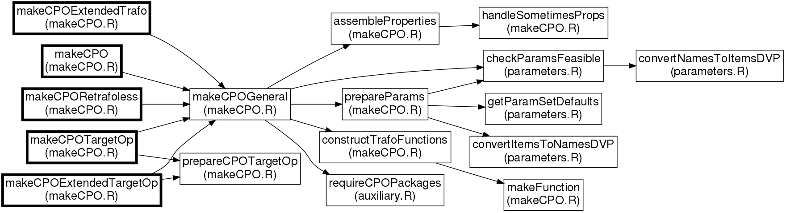
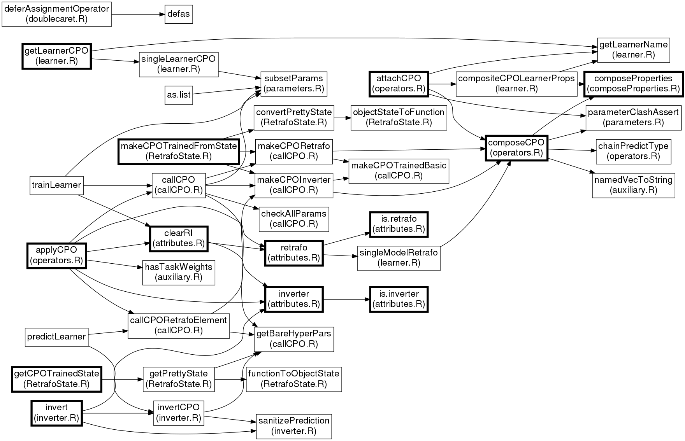
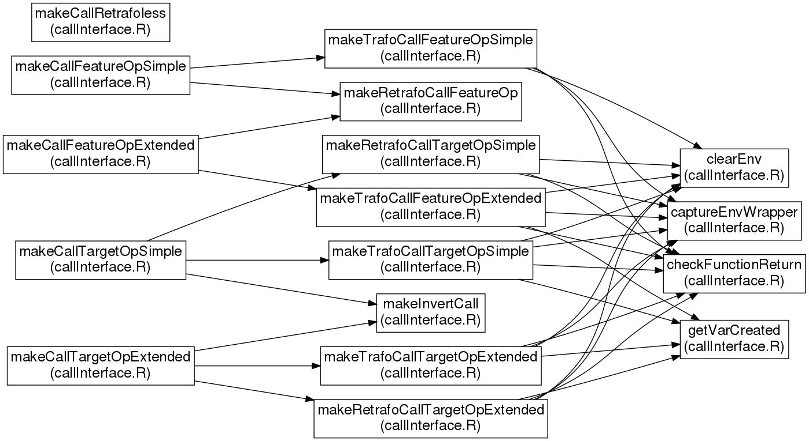
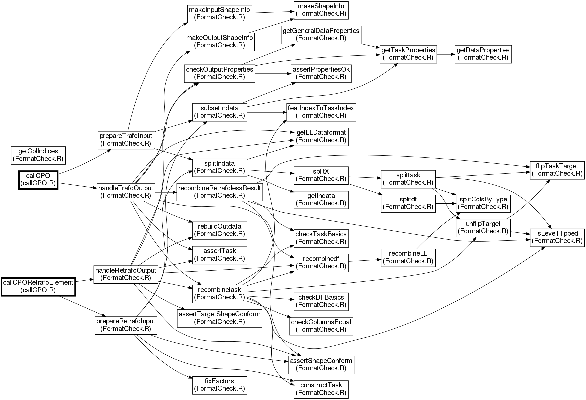

# mlrCPO Internals

This file is written in markdown and should be found in the `info` directory; a compiled `.pdf` version is also supplied in the same directory.

The following describes the internal design of `mlrCPO`. Package names, file names, and object names are in monospace: `Classname`; functions are monospace with parentheses: `fun()`; exported functions are followed by an asterisk: `exportedFun()*`; list slots are monospace, prepended with a dollar sign: `$slot`.

## Overview

`mlrCPO` builds on the `mlr` package and adds flexible preprocessing operator objects. Please make sure you are familiar with the user interface, by reading the vignettes, the R help pages, and possibly going through the tutorial.

## Coding Style

To fit in with the rest of *mlr-org*, it follows the same [code style guide](https://github.com/rdatsci/PackagesInfo/wiki/R-Style-Guide). A subset of this style is checked by [lintr](https://github.com/jimhester/lintr) automatically during tests. Use the `quicklint` tool in the `tools` directory to run lint on only the files that have changed with respect to the `master` branch.

## Class Structure

The central object of `mlrCPO` is the `CPO` with the following lifecycle and subclasses:

```
CPOConstructor ---------> CPO ---------------> CPOTrained / CPOTrainedPrimitive
                         /   \                    /   \
                        /     \                  /     \
              CPOPrimitive   CPOPipeline  CPORetrafo  CPOInverter
```

The `CPOConstructor` is a function that is called to create a `CPO`, examples are `cpoPca` and `cpoScale`. It is generated by `makeCPO()*` and similar functions. `CPO` is the object representing a specific operation, completely with hyperparameters. `CPOTrained` represents the "retafo" operation that can be retrieved with `retrafo()*` or `inverter()*` from a preprocessed data object, or from a trained model.

```
CPO -------------------> CPOLearner -------------------> CPOModel
```

When a `CPO` gets attached to an `mlr` `Learner`, a `CPOLearner` object is created. The trained model of this learner has the class `CPOModel`.

### `CPOConstructor`

`CPOConstructor` is created in `makeCPOGeneral()` which is called by `makeCPO()*` or `makeCPOExtended()*`, or similar functions, all defined in `makeCPO.R`. A `CPOConstructor` is an R *function* that takes all the `CPO`'s arguments, as well as the `affect.*`, `export`, and `id` special arguments and assembles a `CPO` object. The body of each `CPOConstructor` is the same and can be found in `makeCPO.R`, starting at
```R
funbody = quote({
```

### `CPO`

A `CPO` can either be "primitive" or "compound".

The primitive `CPO` has the additional class `CPOPrimitive` and is at the heart of `mlrCPO` functionality. It is defined and documented in `makeCPO.R` starting at
```R
cpo = makeS3Obj(c("CPOPrimitive", "CPO"),
```
Besides much meta-information, the primitive `CPO` stores the parameter set as `$par.set` and `$unexported.par.set`, as well as the parameter values as `$par.vals` and `$unexported.pars`. The trafo and retrafo operations are functions stored in the `$trafo.funs` slot.

A compound `CPO` can be created from two `CPO`s by composing them using the `%>>%` operator, which calls `composeCPO()*` (which can also be called directly). It has the additional class `CPOPipeline`, and is defined in `composeCPO()*`. Compound `CPO`s have a tree structure: Each compound `CPO` has a slot `$first` and `$second`, referencing two child `CPO`s (which may be compound *or* primitive) in the order in which they are applied. Otherwise `CPOPipeline` objects are relatively lightweight, they store meta-information computed from the child objects (e.g. a name referencing both children, and common properties), and parameter values.

When the hyperparameter of a `CPOPipeline` are changed, the child nodes are not modified; instead, the changed parameter values are stored in the root node. The parameter values of the child nodes are only updated when the `CPO` is actually called.

### `CPOTrained`

`CPOTrained` objects are created in `makeCPOTainedBasic`, which is called by `makeCPORetrafo` and `makeCPOInverter`, which are both called by `callCPO.CPOPrimitive`. `CPOTrained` objects are thus created whenever data is fed into a `CPO`, be it by using `%>>%`, by calling `applyCPO()*` directly, or by training a `CPOLearner`.

The main part of a `CPOTrained` object is the `$element` slot, which contains a linked list of `RetrafoElement` or `InverterElement` objects. Each retrafo or inverter operation stored in a `CPOTrained` has a corresponding object in this linked list. The slots of the `CPOTrained` object besides `$element` contain collective information about the operation in total: conversion (`$convertfrom`, `$convertto`), overall `$properties`, possible `$predict.type` and retrafo- or inverter-`$capability`.

The `RetrafoElement` / `InverterElement` objects are relatively lean; they mostly point to the `CPOPrimitive` objects that helped create them, contain a `$state` slot which contains the control objects or retrafo functions created by the `cpo.train` call, and "shapeinfo" about the data shape (feature names and types) used when calling the trafo. The element objects are connected by the `$prev.retrafo.elt` slot, which point to the operation to be done before the operation represented by the element.

A `CPOTrained` can be a "retrafo", an "inverter", or both. A retrafo has the `CPORetrafo` class and is used to re-apply a transformation that was "trained" on a dataset. An inverter has the `CPOInverter` class, it concerns only "Target Operation `CPO`s". It is created whenever a target operation `CPO` is applied to a dataset and gives the user the possibility of inverting the prediction performed with the transformed dataset. If the target operation `CPO` has the `constant.invert` flag set, the resulting inverter can be used on *any* prediction; otherwise, the inverter can only be used on predictions made with the resulting transformed dataset. Since the inverters resulting from `constant.invert` target operation transformations can be used on any new data, they are retrieved with the `retrafo()*` call, they both retrafo and inverter and have both the `retrafo` and `invert` *capability* set. The `CPOInverter` specific to the prediction of an individual processed dataset is retrieved using `inverter()*`.

The `callCPO()` call generates both `CPORetrafo` and `CPOInverter` linked lists; they are stored as attributes of the resulting data by `applyCPO.CPO()*`. `retrafio()*` and `inverter()*` are both relatively dumb functions which retrieve these object attributes.

### `CPOLearner`

The `CPOLeaner` is created using `mlr`'s `makeBaseWrapper()*` functionality, in `attachCPO()*`. Whenever another `CPO` is attached to a `CPOLearner`, the Learner is not wrapped again, instead the attached `CPO` is extended. The `CPOLearner` also has properties and hyperparameters that are extended / modified according to the `CPO`. Whenever the hyperparameters of a `CPOLearner` are changed, the attached `CPO` (and its `$par.vals` slot) is not modified; instead, the `CPO` is modified upon invocation of `trainLearner.CPOLearner()*`.

When the `train()` method is called with a `CPOLearner`, the resulting model has a `CPOTrained` attached on the `$retrafo` slot: the `CPORetrafo` chain used for preprocessing. A `CPOInverter` object is only created during prediction for the specific data being predicted.

### `NULLCPO`

The `NULLCPO` object has a special place in `mlrCPO`: It is the neutral element of the `%>>%` operator and stands for an "empty" cpo. All functions pertaining to it are in `NULLCPO.R`. They are mostly about giving empty or unmodified results.

## File Overview

The `.R` files in the `R` directory can be divided into three groups: *Core* files, *auxiliary* files, and *CPO definition* files. The latter group are all prefixed with a `CPO_`. As of writing of this document, there are 22 `.R` files in the `R` directory that are not CPO definition files and make up the back-end of the `mlrCPO` package. They are listed here, in approximate order of importance or dependence, and with a short description. The most important files are described in more detail in [Functionality](#functionality).

### Core Files

These files are the core of `CPO` inner workings.

| File Name            | Description                                                |
|:---------------------|:-----------------------------------------------------------|
| `makeCPO.R`          | `makeCPO()*` and related functions, for definition of `CPOConstructor`s |
| `callCPO.R`          | Invocation of `CPO` trafo and retrafo functions, and creation of `CPOTrained` |
| `FormatCheck.R`      | Checking of input and output data conformity to `CPO` "properties", and uniformity of data between trafo and retrafo |
| `callInterface.R`    | Unification of the different `CPO` call styles to a single interface to be invoked by `callCPO` |
| `operators.R`        | Composition and splitting of `CPO` and `CPOTrained` objects |
| `properties.R`       | Getters and setters of `CPO` object properties |
| `learner.R`          | Everything `CPOLearner`-related: Attachment of `CPO` to `Learner`, training and prediction |
| `inverter.R`         | Framework for of `CPO` inverter functionality |
| `RetrafoState.R`     | Retrieval of the retrafo state, and re-creation of a `CPORetrafo` from it |

### Auxiliary Files

These files give auxiliary functions and boilerplate.

| File Name            | Description                                                |
|:---------------------|:-----------------------------------------------------------|
| `doublecaret.R`      | `%>>%`-operators |
| `attributes.R`       | `retrafo()*` and `inverter()*` functions that access object attributes |
| `print.R`            | Printing of `CPO` objects |
| `parameters.R`       | Auxiliary functions that check parameter feasibility and overlap |
| `composeProperties.R` | Auxiliary function for composition of the `$properties` slot |
| `NULLCPO.R`          | `NULLCPO` object and all related functions |
| `fauxCPOConstructor.R` | Helper function for alternative way of creating `CPOConstructor`s |
| `listCPO.R`          | Listing of present `CPO`s |
| `auxiliary.R`        | General helper functions |
| `zzz.R`              | Package initialization and import of external packages |
| `auxhelp.R`          | Roxygen documentation for the `CPO` lifecycle |
| `makeCPOHelp.R`      | Roxygen documentation for `makeCPO()*` functions |
| `CPOHelp.R`          | Roxygen template documentation base for `CPOConstructor` functions |

### CPO Definition Files

The most interesting files containing concrete `CPO` implementations.

| File Name            | Description                                                |
|:---------------------|:-----------------------------------------------------------|
| `CPO_meta.R`         | `cpoMultiplex` and `cpoCase` |
| `CPO_cbind.R`        | `cpoCbind` and its special printing function |
| `CPO_filterFeatures.R` | Feature filter `CPO`s |
| `CPO_impute.R`       | Imputation `CPO`s |
| `CPO_wrap.R`         | `cpoWrap` and `cpoWrapRetrafoless` `CPO` wrappers |
| `CPO_select.R`       | `cpoSelect` and `cpoSelectFreeProperties` |

## Functionality

### `CPO` Creation (`makeCPO.R`)



*Map of `makeCPO` function calls, exported functions are bold*

`CPOConstructor`s are created by calling `makeCPO.R`. Actual creation happens in `makeCPOGeneral()`, which gets called with different values depending on which `makeCPOXXX()*` is called by the user. (Before that, `prepareCPOTargetOp` does some preparation that is specific to target operation `CPO`s.) `makeCPOGeneral()` relies on a few helper functions that prepare the slots of the final `CPO` object: `assembleProperties()` generates the `$properties` slot from the given `properties.*` parameters; `prepareParams()` handles parameters and parameter exports; `constructTrafoFunctions()` creates the `$trafo.funs` trafo and retrafo functions (See [callInterface.R](#call-interface-callinterfacer)). If the functions are given as special NSE blocks (just curly braces without function headers), `makeFunction()` creates the necessary function headers, otherwise the given headers are checked.

The actual `CPOConstructor` is a function that collects its arguments (using `match.call()`), creates a `par.vals` and `unexported.pars` list, and puts them into a big `CPOPrimitive` S3-object which it returns. The `CPOConstructor` function is created artificially by `makeCPOGeneral` by using a custom function header (*formals* in `R` lingo) that reflects the `CPO`'s `ParamSet`.

### `CPO` Invocation (`callCPO.R`, `inverter.R`)



*Map of several exported functions and their close dependents*

Invocation of `CPO`s is done when the user calls `applyCPO()*` and happens recursively by the `callCPO()` function: If called with a `CPOPipeline`, the given data is first transformed by the `$first`, then by the `$second` slot (which in turn may be `CPOPipeline` objects). If called with a `CPOPrimitive`, the necessary data and property checks and conversions (See [Format Check](#format-check-formatcheckr)) are performed, the `$trafo.funs$cpo.trafo` slot (as generated by [callInterface](#call-interface-callinterfacer)) is called, and the `CPORetrafo` and `CPOInverter` chains are constructed by `makeCPORetrafo()` and `makeCPOInverter()`. The chains are constructed by adding a new head to the `prev.retrafo` and `prev.inverter` arguments.

When the user calls `applyCPO()*` with a `CPORetrafo`, the `callCPORetrafoElement()` function is used. `CPOTrained` objects contain a linked lists in their `$element` slot. Therefore, `callCPORetrafoElement()` recursively calls itself if it finds a `$prev.retrafo.elt`. For target operating `CPO`s, an inverter `CPOTrained` chain is constructed using `makeCPOInverter()` in a similar way to how it is constructed in `callCPO()`, adding newly created `CPOInverter` objects to the top of the `prev.inverter` linked list.

Prediction inversion is done when the user calls `invert()*` and is done in the `invertCPO()` function, which recursively calls itself for all present `InverterElement`s. `invert()*` tries to work with both `mlr` `Prediction` objects and ordinary `data.frame`, `matrix` or vector shaped predictions by first converting them to a common (`data.frame`) shape and then, if necessary, by constructing a new `mlr` `Prediction`.

#### Other Exported Functionality (`operators.R`, `learner.R`, `RetrafoState.R`)

The map above shows the interaction of the `applyCPO()` / `invertCPO()` functions with other exported functionality:

- **CPO Composition** is done by `composeCPO.CPO()*`, which creates `CPOPipeline` objects that have the constituent `CPO`s in their `$first` and `$second` slot. It also takes care that parameters of composed `CPO`s don't clash (`parameterClashAssert()`) and constructs the properties and `$predict.type` of the resulting compound `CPO` using `composeProperties()` and `chainPredictType()`.
- **CPOTrained Composition** is done by `composeCPO.CPOTrained()*`, which has similar responsibilities but creates a linked list instead of a tree. It discards the `CPOTrained` head of its inputs, chains their `$element` linked lists, and creates a new `CPOTrained` head that reflects the new `properties`, `predict.type`s and `capabilities` of the chained object.
- **CPO Learners** are created using `attachCPO()*`, which uses `mlr`'s `mkaeBaseWrapper` functionality to wrap the given `Learner` in a `CPOLearner`. To prevent deep nesting of learners, if a `CPO` is attached to a `CPOLearner`, the `Learner` is *not* wrapped another time, instead the already attached `CPO` is extended by the new `CPO`. A tricky part of extending a `Learner` with a `CPO` is the calculation of resulting learner properties, which is performed by `compositeCPOLearnerProps()`. The predict type of a `CPOLearner` respects the `$predict.type` slot of the attached `CPO`(s); this translation is done by `setPredictType.CPOLearner()`. The `trainLearner` and `predictLearner` functions shown in the map are called when a `CPOLearner` is invoked. They use `callCPO()`, `callCPORetrafoElement()` and `invertCPO()` to modify the data that comes in to and goes out of the wrapped `Learner`.
- **CPOTrained State** can be gotten from a `CPOTrained` using `getCPOTrainedState`, which prepares the `$state` stored in a `RetrafoElement` or `InverterElement` to a common format (since different `CPO`s using different [call interfaces](#call-interface-callinterfacer) have different state layouts) using `getPrettyState()`. For functional `CPO`s, it uses `functionToObjectState()` to convert a function's `environment` to a `list` with appropriate layout. `makeCPOTrainedFromState()*` creates a bare `CPO` object from the given constructor and puts in the state information.

### Call Interface (`callInterface.R`)



*Map of `callInterface.R`*

The `callInterface.R` functions provide wrapper functions for the different kinds of "trafo" and "retrafo" calls that different kinds of CPO offer. When a `CPO` is invoked for trafo or retrafo, `callCPO` just calls these wrapper-functions in the `$trafo.funs` slot of the given `CPO`, with a standard set of arguments. The routing between `cpo.train()`, `cpo.trafo()`, `cpo.retrafo()`, `cpo.traininvert()` and `cpo.invert()` functions (as given by the `makeCPO()` user) happens inside these wrapper functions.

`constructTrafoFunctions()` in `makeCPO.R` calls one of the `makeCall*()` functions (first rank in the map) in `callInterface.R`, which populate the `$trafo.funs` `CPO`-slot. The wrapper functions (mostly generated in the second rank in the map) rely on a few helper functions (third rank) that are used for capturing and checking return values of user-supplied `cpo.train()` etc. functions.

### Format Check (`FormatCheck.R`)



*Map of `FormatCheck.R`*

`FormatCheck.R` is a central part of `CPO` that does checking of input and output data for property adherence, checking that input data to retrafo conforms to input data to the corresponding trafo invocation, and conversion of data depending on `dataformat` values for a given CPO.

Data preparation and post-processing is done by the functions `prepareTrafoInput()`, `prepareRetrafoInput()`, `handleTrafoOutput()`, and `handleRetrafoOutput()`. They are called by `callCPO()` for `*Trafo*` and `callCPORetrafoElement()` for `*Retrafo*`. Each of these takes the data, desired properties, and possibly shape-info (data feature column type info), checks the data validity, and returns the converted data according to the `dataformat` and the type of the `CPO`.

Functions in `FormatCheck.R` can be grouped into

- **Top level functions**: `{prepare,handle}{Trafo,Retrafo}{Input,Output}` are called by outside functions `callCPO()` and `callCPORetrafoElement()`.
- **ShapeInfo handling**: `makeInputShapeInfo()`, `makeOutputShapeInfo()` create `ShapeInfo` objects that contain information about the shape layout of data coming in and going out of a *trafo* function. This is then used during *retrafo* by `assertShapeConform()` and `assertTargetShapeConform()` to check that the data has still the shape it is supposed to have. `fixFactors()` is called when the `fix.factors` flag is set to make sure that factors during `retrafo` have the same levels as during `trafo`.
- **Properties checking**: The properties of data coming in need to be compared to the properties that a `CPO` is allowed to handle, and to be checked for unallowed additions of column types or missings. The properties of data are collected by `getGeneralDataProperties()` and checked in `assertPropertiesOk()` during `CPO` input and `checkOutputProperties()` during `CPO` output.
- **Data splitting and recombining**: According to the given `dataformat` of a `CPO`, the data given to its `trafo` and `retrafo` functions needs to be converted and / or split into `data.frame`(s) or a `Task`. This is done during input in `splitIndata()` and by its dependent `split*()` functions. Recombination happens, depending on whether the output will be a `Task` or a `data.frame`, by `recombinetask()` or `recombinedf()` (or `recombineRetrafolessResult()` for a "retrafoless" `CPO`). The recombination functions also check that a `CPO` did not change columns it may not modify (target columns during feature operation, feature columns during target operation) using `checkTaskBasics()`, `checkDFBasics()`, and `checkColumnsEqual()`.
- **Column type dataformat**: An auxiliary role is played by `getIndata()` and `rebuildOutdata()`: If the `dataformat` is a column type (`"numeric"`, `"factor"` etc.), internally the splitting of data is done according to the `"split"` dataformat (this conversion is done by `getLLDataformat()`). Only right before the data is given to the `CPO`, the split data is subset using `getIndata()`; right when the `CPO` returns its result, it is recombined again in `rebuildOutdata()`.
- **`affect.*` parameter handling**: `affect.*` parameters are converted into column indices by `getColIndices()` and then handled by `subsetIndata()` during input. `recombineLL()` uses these column indices to rebuild the complete `Task` / `data.frame` from the (subset) returned from the `CPO` `trafo` / `retrafo` and the remaining original data.

### The `%>>%`-Operator (`doublecaret.R`)

The `%>>%` operator is syntactic sugar for the `applyCPO()*`, `composeCPO()*`, and `attachCPO()*` functions defined in `callCPO.R`, `operators.R`, and `learner.R`.

To implement the nonstandard right-to-left evaluation order of some operators (`%<<<%`, `%<>>%`, and `%>|%`), a call to one of the `%>*%` operators first triggers a reorganisation of the abstract syntax tree by `deferAssignmentOperator()` to manipulate call order. It replaces all operators by "`internal%>>%()`" and similar functions (so that AST reorganisation is not invoked again). These functions then go on to call the correct operation functions.

### `retrafo()*` and `inverter()*` (`attributes.R`)

Both `retrafo()*` and `inverter()*` are very lightweight functions that only access the respective attributes of a data object. If the data object has no such attribute, a `NULLCPO` is returned, instead of `NULL`, so that `y %>>% retrafo(x)` works even when no retrafo is present. An exception is made for `CPOModel`: It retrieves the `CPORetrafo` generated while training a `CPOLearner`; the generic is found in `CPOLearner.R`.

### NULLCPO (`NULLCPO.R`)

The `NULLCPO` object is implemented by implementing all generics for it, and have them do the respective no-op.

### `CPO` listing (`listCPO.R`)

A `CPO` is registered in a global variable `CPOLIST` by calling `registerCPO` with the respective descriptive items. To have definition and documentation relatively close, `registerCPO` should be called right after the definition of an internal `CPO`. The `listCPO` function then only creates a `data.frame` from this list.

